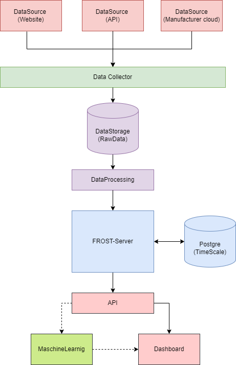

# Project description

General description and aim of project.

## Step 1: Context and Scope

**Define context and scope of the project.**

Aim of the project is to collect data form environmental sensors from different
sources and use the FROST-Server to manage, store and deliver the data.

Many organisations face the problem that sensor data is delivered in different
schemas from different devices in different ways. The ability to use data from
different sources in an analysis, one project or a model allways requires
a first step of harmonising the data. Our goal is to reduce or even elimenate this
first step by setting up an infrastructure that does this automaticly.

A key element in this project is The FROST Server which is an open source implementation
of the OGC SensorThings API.

The sensor data from the different sources has to be prepared to fit into the
scheme of the OGC SensorThings API. For collecting and preparing the data may an
data ochastrator (like dagster) be used.
The collected sensor data than can be consumed over one API for the use in a dashboard,
further analysis with python or R or in a model.
The system should be able to handle historic and real-time data.

It will be designed to work with different data sources and expandability in mind.
The advantage of the system will be that it provides a single point for sensor data.
The aim is to connect different sources and systems rather than replacing them.

## Step 1: Data sources

List of available DataSources and their description.

- [PegelOnline](https://www.pegelonline.wsv.de/gast/start)
- [NLWKN Groundwater](https://www.grundwasserstandonline.nlwkn.niedersachsen.de/Start)
- DWD (Deutscher Wetterdienst)
- [OpenWeatherMap](https://openweathermap.org/)

## Step 2: Data Storage

### Overall considerations

The data in this project are mainly measurement values. The different sensors record
measurements over time at a specific location.

The data can be devided into three categories:

- **timeseries data**: observations (meassured values) at a certain point in time
- **spatial data**: location of sensors or stations where the sensor is located as coordinates
- **master data**: information about the sensors and stations

### Timeseries data

Measurements are typically timeseries data. They consist of as measured value at
a certain point in time. Therefor they are structured and have relations.
Every Dataset consists of timestamp, measured value, measured parameter, unit and location.

A relational Database seems to be the best option to store the data.

There are also specialized Database for timeseries data like InfluxDB or TimeScaleDB.

The FROST Server that is going to be used in this project only supports PorstgreSQL.
For timeseries data we are limited to Postgre.

### Spatial Data

The locations of the sensors are spatial data, consisting of coordinates.
For this kind of data a spatial database will be used.
The FROST Server supports PostgreSQl with PostGIS so the spatial data can be stored
in the same Database as the timeseries data.

### Master data

Information for the different sensors and stations can be various, because there will
be different kind of sensors. The data is unstructured and therefore will be stored
in a nosql database.

## Step 3: Data consumption

Dashboard maybe grafana or dask or ...

## Step 4: Deployment

Create API (maybe FastAPI if necesary because the FROST Server allready provides an API)
Dockerize

## Step 5: Automate the flows

Automation of the different steps (maybe dagster for pipeline)
